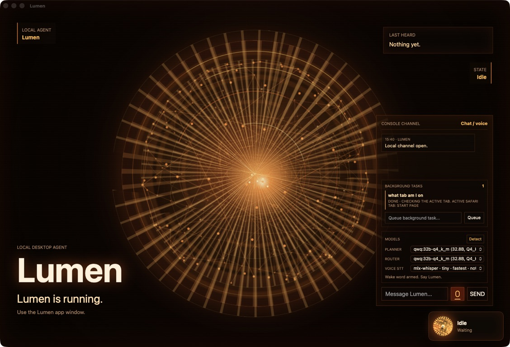

<p align="center">
  
</p>

<h1 align="center">Lumen</h1>

<p align="center">A local-first macOS desktop agent that runs on your machine, opens its own app window, and uses local models for planning and voice.</p>

<p align="center">
  <a href="https://lumen.ompatnaik.com">lumen.ompatnaik.com</a> ·
  <a href="#install-with-homebrew">Install</a> ·
  <a href="#current-state">Current state</a>
</p>

<p align="center">
  <strong>Native app window</strong> ·
  <strong>Local model detection</strong> ·
  <strong>Desktop orb presence</strong> ·
  <strong>Optional voice control</strong>
</p>

Lumen is an experimental desktop agent framework. It starts a local server on your Mac, renders the interface inside a native `Lumen.app` window, and can use local tools to open apps, open URLs, search the web, take screenshots, and handle approved file or shell actions.

<p align="center">
  
</p>

> [!IMPORTANT]
> Lumen is an early prototype for Apple Silicon Macs. It can open applications, use the browser, take screenshots, and request shell or file operations. Review confirmation prompts before approving actions.

## What it is

Lumen is not a hosted chatbot and it does not run automation in the cloud. The app runs locally, talks to local model providers such as Ollama or LM Studio, and keeps model weights outside the repository.

When launched from `Lumen.app`, the user-facing interface is a macOS window. The local backend is still available at `http://127.0.0.1:8765`, but the intended experience is the native app window plus the floating bottom-right Lumen orb.

The Lumen image used by this README lives at:

```text
assets/lumen-icon.png
```

The editable source icon is:

```text
assets/lumen-icon.svg
```

## Current state

- Native macOS app wrapper in `~/Applications/Lumen.app`
- Native Lumen interface window backed by localhost
- Transparent bottom-right AppKit orb overlay
- Local model detector for Ollama and LM Studio
- Model selectors for planner, router, and speech-to-text
- First-pass wake-word mode: say "Lumen" before a command in the native app
- Persistent background task queue
- Browser tab controls for Safari and Chrome-family browsers
- In-app approval queue for risky actions
- Optional live speech recognition and local voice transcription
- Local command execution with confirmation for riskier tools

## Install with Homebrew

The Homebrew formula installs Lumen's native app and Python runtime. Models remain separate and local to your machine.

```sh
brew install --formula https://raw.githubusercontent.com/OmTheLast/Lumen/main/Formula/lumen.rb
lumen-app
```

You still need a local model provider such as Ollama and at least one chat model:

```sh
brew install ollama
ollama serve
ollama pull qwen3:latest
```

The formula installs the app bundle inside Homebrew's prefix and provides `lumen-app` to open it. It does not download model weights, send prompts to a hosted API, or require `uv` at runtime.

## Install from source

### 1. Install the prerequisites

- macOS on Apple Silicon
- [uv](https://docs.astral.sh/uv/)
- [Ollama](https://ollama.com/) running locally
- At least one local chat model in Ollama or LM Studio

```sh
ollama pull qwen3:latest
```

Model weights are intentionally not stored in this repository. Keep Ollama, LM Studio, Whisper, and other model caches outside git. Lumen detects installed models at runtime instead of requiring one fixed model name.

### 2. Clone and install Lumen

```sh
git clone https://github.com/OmTheLast/Lumen.git
cd Lumen
uv sync
```

For optional local voice transcription, install the voice dependencies too:

```sh
uv sync --extra voice
```

### 3. Start Lumen

Run it directly from Terminal:

```sh
uv run python -m lumen.main
```

Or build and install the macOS app wrapper:

```sh
scripts/build_macos_app.sh --install-user
open ~/Applications/Lumen.app
```

The source-built app is a local development build, not a signed or notarized download. It needs this checkout and a separately installed local model. Its launcher detects `uv` in `~/.local/bin`, Homebrew, or a path supplied through `LUMEN_UV_PATH`.

## Configuration

Lumen can detect local chat models from:

- Ollama at `http://localhost:11434`
- LM Studio's OpenAI-compatible server at `http://localhost:1234`

The app interface includes model selectors for planner, router, and voice transcription models. Saved selections are written to:

```text
~/.lumen/config.json
```

Environment variables still override saved settings:

```sh
LUMEN_PLANNER_MODEL=qwen3.6:27b
LUMEN_ROUTER_MODEL=qwen3:latest
LUMEN_VOICE_STT_MODEL=mlx-community/whisper-tiny
```

## Using Lumen

Open the packaged app:

```sh
open ~/Applications/Lumen.app
```

Build or reinstall the app wrapper from the repo:

```sh
scripts/build_macos_app.sh --install-user
```

The app wrapper starts Lumen in app mode, opens the native Lumen window, and writes logs to:

```text
~/Library/Logs/Lumen/lumen.log
```

If the backend cannot start, the native window now shows the startup error and this log path. Homebrew builds launch their packaged Python directly; source builds find `uv` even when Finder does not inherit your shell `PATH`.

Lumen starts a local presence server at `http://127.0.0.1:8765`. When launched from `Lumen.app`, that local interface opens inside a native macOS window instead of a browser tab. The interface shows Lumen's current state and a bottom-right icon that animates while it listens, thinks, acts, or speaks.

Lumen also starts a native always-on-top orb at the bottom-right of your screen. It uses the same state as the app interface, so it stays visible even when the main window is behind other windows.

The native orb reads from the local presence server, so disabling the UI also disables the orb.

To run the local backend without opening any interface:

```sh
LUMEN_UI_OPEN_BROWSER=0 LUMEN_APP_WINDOW_ENABLED=0 uv run python -m lumen.main
```

To disable the UI entirely:

```sh
LUMEN_UI_ENABLED=0 uv run python -m lumen.main
```

To disable only the native orb:

```sh
LUMEN_OVERLAY_ENABLED=0 uv run python -m lumen.main
```

Try:

```text
open Safari
search the web for Apple Silicon MLX Whisper
open Chrome and search for local LLM agents
new tab
open new Chrome tab with example.com
next tab
previous tab
reload tab
close tab
what tab am I on
take a screenshot called desktop
```

Browser controls currently use macOS AppleScript. Safari, Google Chrome, Brave Browser, and Microsoft Edge have first-class tab support; macOS may ask for automation permission the first time Lumen controls a browser.

Riskier tools such as screenshots, shell commands, and file writes pause for approval. In `Lumen.app`, pending approvals appear in the console with the tool name, risk, reason, arguments, and Approve/Reject controls.

## Background tasks

Lumen can queue local background tasks from the app or from chat/voice commands:

```text
task research Apple Silicon local voice models
start background task open a new tab with example.com
```

Tasks are stored locally at:

```text
~/.lumen/tasks.json
```

The first version of the task engine runs queued objectives one at a time through Lumen's existing planner and tools, records status/events/results, and exposes recent tasks in the app window plus the local `/tasks` API. This is the foundation for longer-running autonomous work; multi-step planning, pause/resume controls, and rich approval UI are still upcoming.

## Voice

Voice is optional. Install the voice dependencies with:

```sh
uv sync --extra voice
```

Then run Lumen and use:

```text
/voice
```

Lumen records until you stop speaking, transcribes with `mlx-whisper`, executes the command, and speaks the response with macOS `say`. The command recorder is tuned for short instructions: by default it listens for up to 8 seconds and stops after roughly 0.45 seconds of silence.

In `Lumen.app`, the microphone button uses native macOS speech recognition and streams partial results into the interface before sending the final command to Lumen. This avoids waiting for a full audio file before command execution. The app also starts a first-pass wake listener: say "Lumen" followed by a command, or say "Lumen" and then give the command after the app wakes. Terminal voice mode still uses local `mlx-whisper`.

To force a fixed recording window:

```text
/voice 5
```

The default speech-to-text model is `mlx-community/whisper-tiny` for speed. The model picker also includes stronger `mlx-whisper` presets:

```text
mlx-community/whisper-base-mlx
mlx-community/whisper-small-mlx
mlx-community/distil-whisper-large-v3
mlx-community/whisper-large-v3-turbo-q4
mlx-community/whisper-large-v3-turbo-8bit
mlx-community/whisper-large-v3-turbo
```

For terminal `/voice`, try `mlx-community/whisper-large-v3-turbo-q4` first if you want better accuracy without jumping straight to the heaviest model. You can override the model manually:

```sh
LUMEN_VOICE_STT_MODEL=mlx-community/whisper-large-v3-turbo-q4 uv run python -m lumen.main
```

The first transcription may take longer while the Whisper model downloads.

For the fastest interactive path, use the Lumen app window. The next architecture step is replacing speech-recognition-based wake detection with a tiny local wake-word model so idle listening is lighter and more private.
