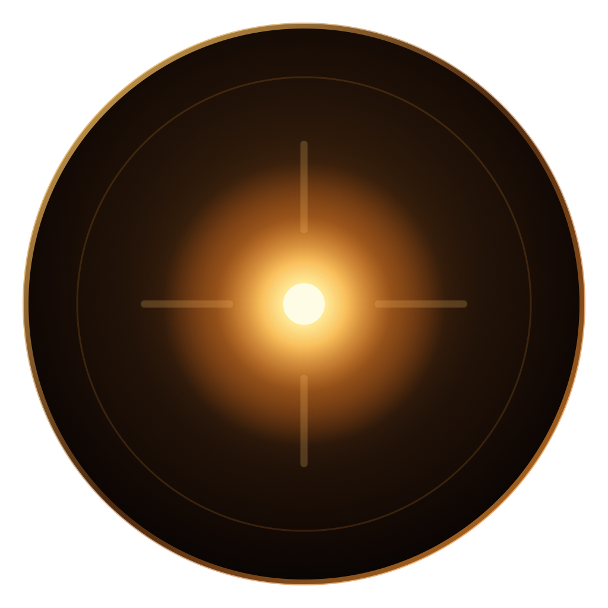

<p align="center">
  
</p>

<h1 align="center">Lumen</h1>

<p align="center">A local-first macOS desktop agent that runs on your machine, opens its own app window, and uses local models for planning and voice.</p>

<p align="center">
  <strong>Native app window</strong> ·
  <strong>Local model detection</strong> ·
  <strong>Desktop orb presence</strong> ·
  <strong>Optional voice control</strong>
</p>

Lumen is an experimental desktop agent framework. It starts a local server on your Mac, renders the interface inside a native `Lumen.app` window, and can use local tools to open apps, open URLs, search the web, take screenshots, and handle approved file or shell actions.

> [!IMPORTANT]
> Lumen is an early prototype for Apple Silicon Macs. It can open applications, use the browser, take screenshots, and request shell or file operations. Review confirmation prompts before approving actions.

## What it is

Lumen is not a hosted chatbot and it does not run automation in the cloud. The app runs locally, talks to local model providers such as Ollama or LM Studio, and keeps model weights outside the repository.

When launched from `Lumen.app`, the user-facing interface is a macOS window. The local backend is still available at `http://127.0.0.1:8765`, but the intended experience is the native app window plus the floating bottom-right Lumen orb.

The Lumen image used by this README lives at:

```text
assets/lumen-icon.png
```

The editable source icon is:

```text
assets/lumen-icon.svg
```

## Current state

- Native macOS app wrapper in `~/Applications/Lumen.app`
- Native Lumen interface window backed by localhost
- Transparent bottom-right AppKit orb overlay
- Local model detector for Ollama and LM Studio
- Model selectors for planner, router, and speech-to-text
- Optional live speech recognition and local voice transcription
- Local command execution with confirmation for riskier tools

## Setup guide

### 1. Install the prerequisites

- macOS on Apple Silicon
- [uv](https://docs.astral.sh/uv/)
- [Ollama](https://ollama.com/) running locally
- At least one local chat model in Ollama or LM Studio

```sh
ollama pull qwen3:latest
```

Model weights are intentionally not stored in this repository. Keep Ollama, LM Studio, Whisper, and other model caches outside git. Lumen detects installed models at runtime instead of requiring one fixed model name.

### 2. Clone and install Lumen

```sh
git clone https://github.com/OmTheLast/Lumen.git
cd Lumen
uv sync
```

For optional local voice transcription, install the voice dependencies too:

```sh
uv sync --extra voice
```

### 3. Start Lumen

Run it directly from Terminal:

```sh
uv run python -m lumen.main
```

Or build and install the macOS app wrapper:

```sh
scripts/build_macos_app.sh --install-user
open ~/Applications/Lumen.app
```

The app is a local, repo-backed development build—not a signed or notarized standalone download. It still needs this checkout, `uv`, and a separately installed local model.

## Configuration

Lumen can detect local chat models from:

- Ollama at `http://localhost:11434`
- LM Studio's OpenAI-compatible server at `http://localhost:1234`

The app interface includes model selectors for planner, router, and voice transcription models. Saved selections are written to:

```text
~/.lumen/config.json
```

Environment variables still override saved settings:

```sh
LUMEN_PLANNER_MODEL=qwen3.6:27b
LUMEN_ROUTER_MODEL=qwen3:latest
LUMEN_VOICE_STT_MODEL=mlx-community/whisper-tiny
```

## Using Lumen

Open the packaged app:

```sh
open ~/Applications/Lumen.app
```

Build or reinstall the app wrapper from the repo:

```sh
scripts/build_macos_app.sh --install-user
```

The app wrapper starts Lumen in app mode, opens the native Lumen window, and writes logs to:

```text
~/Library/Logs/Lumen/lumen.log
```

Lumen starts a local presence server at `http://127.0.0.1:8765`. When launched from `Lumen.app`, that local interface opens inside a native macOS window instead of a browser tab. The interface shows Lumen's current state and a bottom-right icon that animates while it listens, thinks, acts, or speaks.

Lumen also starts a native always-on-top orb at the bottom-right of your screen. It uses the same state as the app interface, so it stays visible even when the main window is behind other windows.

The native orb reads from the local presence server, so disabling the UI also disables the orb.

To run the local backend without opening any interface:

```sh
LUMEN_UI_OPEN_BROWSER=0 LUMEN_APP_WINDOW_ENABLED=0 uv run python -m lumen.main
```

To disable the UI entirely:

```sh
LUMEN_UI_ENABLED=0 uv run python -m lumen.main
```

To disable only the native orb:

```sh
LUMEN_OVERLAY_ENABLED=0 uv run python -m lumen.main
```

Try:

```text
open Safari
search the web for Apple Silicon MLX Whisper
open Chrome and search for local LLM agents
take a screenshot called desktop
```

Riskier tools such as shell commands and file writes ask for confirmation.

## Voice

Voice is optional. Install the voice dependencies with:

```sh
uv sync --extra voice
```

Then run Lumen and use:

```text
/voice
```

Lumen records until you stop speaking, transcribes with `mlx-whisper`, executes the command, and speaks the response with macOS `say`.

In WebKit views or browsers that support speech recognition, the microphone button can use live recognition and send the recognized command directly to Lumen. That path avoids waiting for a full audio upload before command execution. If live recognition is unavailable, Lumen falls back to the existing voice-note path.

To force a fixed recording window:

```text
/voice 5
```

The default speech-to-text model is `mlx-community/whisper-tiny` for speed. You can override it:

```sh
LUMEN_VOICE_STT_MODEL=mlx-community/whisper-small-mlx uv run python -m lumen.main
```

The first transcription may take longer while the Whisper model downloads.
